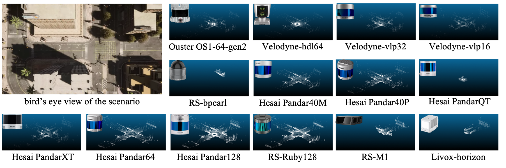
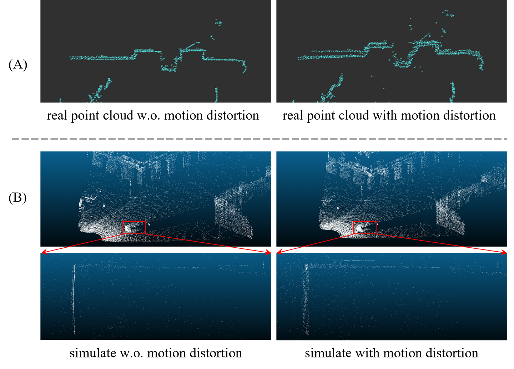

# LiDARSimLib-and-Placement-Evaluation

## LiDAR Simulation Library

### Requirements

+ Carla (>=0.9.12)

### LiDAR List
1. Surround LiDAR
   1. pandar64
   2. ruby128
   3. pandar128
   4. vlp16
   5. hdl64
   6. pandar_qt
   7. bpearl
   8. pandar_40m
   9. pandar_40p
   10. pandar_xt
   11. vlp32
   12. os1_64_gen2
2. Solid State LiDAR
   1. mems_m1
3. Risley Prism LiDAR
   1. horizon
4. Default Carla LiDAR
   1. default LiDARs

### Usage

1. There are two paths should be modified:

```
LiDARSimLib/Unreal/CarlaUE4/Plugins/Carla/Source/Carla/Sensor/livox.cpp
line9: modify depend on your own carla path
LiDARSimLib/PythonAPI/lidar_lib_example/lidar_display.py
line30: modify depend on your own carla path
```

2. Use this file to overwrite the original carla directory

3. Rebuild carla

```
make clean

make PythonAPI

make launch
```

4. Create LiDAR


```
lidar_bp = world.get_blueprint_library().find('sensor.lidar.ray_cast') # choose ray_cast or ray_cast_semantic

lidar_bp.set_attribute("lidar_type", "Surround") # set lidar_type as Surround, Solid_state, Risley_prism

lidar_bp.set_attribute("name","pandar64") # set name as any one in LiDAR List
```

5. Set LiDAR ghosting object effect

```
lidar_bp.set_attribute("enable_ghost", "true") # enable ghosting object effect
```

6. Motion distortion simulation

```
import sys
sys.path.append("/your/path/of/carla/LibCustomFunction") # append the LibCustomFunction
from enable_motion_distortion import LidarMotonDistortion # import the LidarMotonDistortion module # import LidarMotonDistortion module

lidar_motion_distort = LidarMotonDistortion("./horizon/", 10) # init LidarMotonDistortion with file_path and distortion delay_time. file_path is where the data you want to save. delay_time is the ratio of simulator frequency to lidar frequency.

ego_lidar.listen(lambda data: lidar_motion_distort.enable_motion_distortion(data, True)) # enable motion distortion
```

### Results

+	LiDAR beam simulation



+	Motion distortion simulation



+	Ghosting object effect simulation


## LiDAR Placement Evaluation in V2X Scenario

We build our evaluation code upon v2x-vit project.

### Usage

+	Follow the instruction in the readme page in v2x-vit and install the v2x-vit project.

+ Download the pretrained model from here.

+ Use the script in Placement-Evaluation/v2xvit/tools/inference.py for evaluation.
