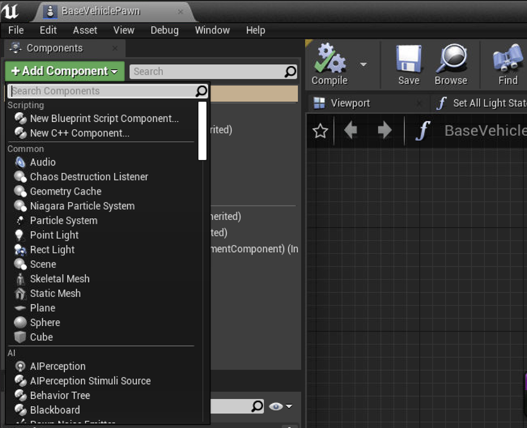

# PCSim: LiDAR Point Cloud Simulation and Sensor Placement
## Overview
<!-- - [News](#news-fire) -->
- [LiDAR Simulation Library](#lidar-simulation-library)
- [LiDAR Placement Evaluation in V2X Scenario](#lidar-placement-evaluation-in-v2x-scenario)
- [RainyPCSim](#rainypcsim)
- [ReSimAD](#resimad)
<!-- - [Citation](#citation) -->


## LiDAR Simulation Library 
[](https://arxiv.org/abs/2211.15975)

https://user-images.githubusercontent.com/21357317/192964768-1b8711a5-742b-4b5b-bf59-c318e2e5c464.mp4

### Requirements

+ Carla (>=0.9.12)

### LiDAR List
1. Surround LiDAR
   1. pandar64
   2. ruby128
   3. pandar128
   4. vlp16
   5. hdl64
   6. hdl32
   7. pandar_qt
   8. bpearl
   9. pandar_40m
   10. pandar_40p
   11. pandar_xt
   12. vlp32
   13. os1_64_gen2
   14. waymo_top
2. Solid State LiDAR
   1. mems_m1
3. Risley Prism LiDAR
   1. horizon
   2. mid40
   3. mid70
   4. avia
   5. tele
4. Default Carla LiDAR
   1. default LiDARs

### Usage

#### 1. There are two paths should be modified:

```
LiDARSimLib/Unreal/CarlaUE4/Plugins/Carla/Source/Carla/Sensor/livox.cpp
line9: modify depend on your own carla path
LiDARSimLib/PythonAPI/lidar_lib_example/lidar_display.py
line30: modify depend on your own carla path
```

#### 2. Use this file to overwrite the original carla directory

#### 3. Rebuild carla

```bash
make clean
make PythonAPI
make launch
```

#### 4. Create LiDAR


```
lidar_bp = world.get_blueprint_library().find('sensor.lidar.ray_cast') # choose ray_cast or ray_cast_semantic

lidar_bp.set_attribute("lidar_type", "Surround") # set lidar_type as Surround, Solid_state, Risley_prism

lidar_bp.set_attribute("name","pandar64") # set name as any one in LiDAR List
```

#### 5. Set LiDAR ghosting object effect

```
lidar_bp.set_attribute("enable_ghost", "true") # enable ghosting object effect
```

#### 6. Motion distortion simulation

+ Import the LidarMotonDistortion module
```
import sys
sys.path.append("/your/path/of/carla/LibCustomFunction") # append the LibCustomFunction
from enable_motion_distortion import LidarMotonDistortion
```
+ Init LidarMotonDistortion with file_path and distortion delay_time
```
lidar_motion_distort = LidarMotonDistortion("./horizon/", 10) # file_path is where the data you want to save. delay_time is the ratio of simulator frequency to lidar frequency.
```
+ Enable motion distortion
```
ego_lidar.listen(lambda data: lidar_motion_distort.enable_motion_distortion(data, True))
```

### Results

####	LiDAR beam simulation


####	Motion distortion simulation


####	Ghosting object effect simulation


## LiDAR Placement Evaluation in V2X Scenario
[](https://colalab.net/media/paper/Optimizing_the_Placement_of_Roadside_LiDARs_for_Autonomous_Driving.pdf)

We build our evaluation code upon [v2x-vit](https://github.com/DerrickXuNu/v2x-vit) project.
### Usage

1. Follow the instruction in the readme page in [v2x-vit](https://github.com/DerrickXuNu/v2x-vit) and install the v2x-vit project.
2. Download the pretrained model from [here](https://drive.google.com/drive/folders/1h2UOPP2tNRkV_s6cbKcSfMvTgb8_ZFj9?usp=sharing).
3. Use the script in Placement-Evaluation/v2xvit/tools/inference.py for evaluation.


## RainyPCSim
Simulate rain effect for LiDAR and collect synthetic LiDAR data in CARLA.
### Requirements
+ Carla (>=0.9.12)
### Usage
1. Following [LiDAR Simulation Library](#usage) 
   Copy and modify files from RainyPCSIM/* to $CARLA_ROOT
2. Rebuild carla
```bash
make clean
make PythonAPI
make launch
```
3. Launch CARLA, and open `$CARLA_ROOT/Unreal/CarlaUE4/Content/Carla/Blueprints/Vehicles/BaseVehiclePawn.uasset` in the blueprint editor.
4. Add component ProxyParticleSpawn.uasset. Click `Add Component` botton, search and add ProxyParticleSpawn component.

5. Create waymo_top LiDAR
```
lidar_bp = world.get_blueprint_library().find('sensor.lidar.ray_cast')
lidar_bp.set_attribute("lidar_type", "Surround")
lidar_bp.set_attribute("name","waymo_top")
```
## ReSimAD
